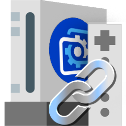

<!-- Banner principal -->
<p align="center">
  
</p>

<h1 align="center">Wii Menu Linker</h1>
<p align="center">
  
</p>

<p align="center">
  <b>A Wii-style launcher for Windows games and programs, with Wallpaper Engine integration.</b>
</p>

<!-- Ejemplo en video -->
<p align="center">
  <b><!-- Demo en video YouTube -->
<p align="center">
  <a href="https://www.youtube.com/watch?v=qnBmHFuWsUM" target="_blank">
    
    <br>
    <b>Ver demo en YouTube</b>
  </a>
</p></b><br/>
  <video src="https://i.imgur.com/6YGgaGZ.mp4" width="480" controls loop poster="https://i.imgur.com/IpMIH2F.png" style="border-radius:16px;box-shadow:0 2px 16px #0003;"></video>
</p>

<p align="center">
  <a href="#features">Features</a> •
  <a href="#installation">Installation</a> •
  <a href="#usage">Usage</a> •
  <a href="#troubleshooting">Troubleshooting</a> •
  <a href="#support">Support</a>
</p>

---

## Features

- 🎮 **Wii-style grid launcher** for your favorite games and programs.
- 🖼️ **Wallpaper Engine integration**: Launch apps from animated wallpapers.
- 🕹️ **Steam & Epic Games detection**: Auto-detects installed games.
- 🗂️ **Custom layouts**: Save and load your own slot arrangements.
- ⚙️ **Windows startup automation**: Run scripts automatically on login.
- 🖱️ **Drag & drop, search, and more!**

---

## Installation

1. **Download** the latest release from [GitHub Releases](https://github.com/tuusuario/wii-programs-linker/releases).
2. **Extract** the ZIP file to a folder of your choice.
3. Run with:
   ```sh
   npm install
   npm start
   ```
   or use the provided installer for Windows.

---

## Usage

- **Add games/programs:** Click a slot, search or browse for an app, or auto-detect Steam/Epic games.
- **Save/load layouts:** Use the "Save Current Layout" and "Manage Layouts" buttons.
- **Wallpaper Engine:** Export your config and use the generated script with Wallpaper Engine events.
- **Startup automation:** Enable "Run on Windows Startup" to auto-launch your script.

---

## Troubleshooting

- **Permissions error writing logs:** The app writes logs to your AppData folder. If you see errors, try running as administrator or check folder permissions.
- **Steam/Epic games not detected:** Make sure your library folders are set correctly in the app settings.
- **Batch file does not work:** Use `npm start` or the installer instead of the .bat file.

---

## Support

- [GitHub Issues](https://github.com/tuusuario/wii-programs-linker/issues)
- Email: <angelangel.martin.tt@gmail.com>
- Discord: angeliust
- [](https://github.com/angeliust/wiimenulinker)
  [](https://youtube.com/@angelabrhm)
  

---

<p align="center">
  
</p>
